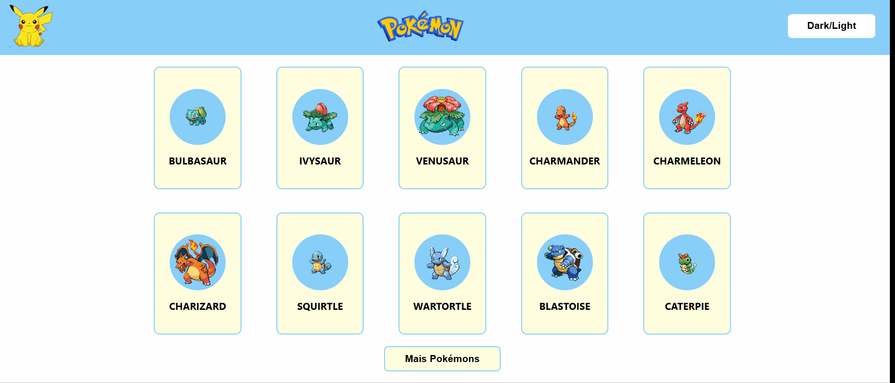

# Quest React Avançado - Pokémon

Este é o projeto da quest react avançado. Uma página que mostra inicialmente 10 cards de pokémons e um botão para carregar mais cards, ao clicar em um card o usuário será redirecionado para uma página interna com mais informações sobre o pokémon como os movimentos, o tipo do pokémon e as habilidades. O design da página é responsivo para se adaptar a vários tamanhos de telas.
 



## Funcionalidades

- Botão para carregar mais 10 cards de pokémons a cada vez que for clicado.

- Botão para alterar a cor do tema da página para dark, para uma melhor experiência do usuário.

- Ao passar o mouse em cima do card do pokémon e do botão Mais Pokémons na página inicial, há uma interação de estilo do hover dos elementos.


### Linguagens utilizadas 

- HTML - > Com a utilização de tags semânticas e acessibilidade.

- Css - > Através do Styled Components do React.

- JavaScript -> A linguagem de programação do projeto.

- React - > Para a reutilização de componentes e a criação do contexto de temas que permitiu a implantação do botão dark mode. 


### Para executar o projeto

Para executar esse projeto, siga esses passos:

1. **Clone esse repositório:** Execute o seguinte comando em um terminal para clonar este repositório no seu computador: 
```
git clone https://github.com/Geicimara-nunes/quest-pokemon.git
```

2. **Instale as dependências:** Vá até o arquivo do projeto e instale o node_modules:
```
npm install
```

3. **Acesse o projeto:** Execute o seguinte comando para acessar o projeto:
```
npm run dev
```
